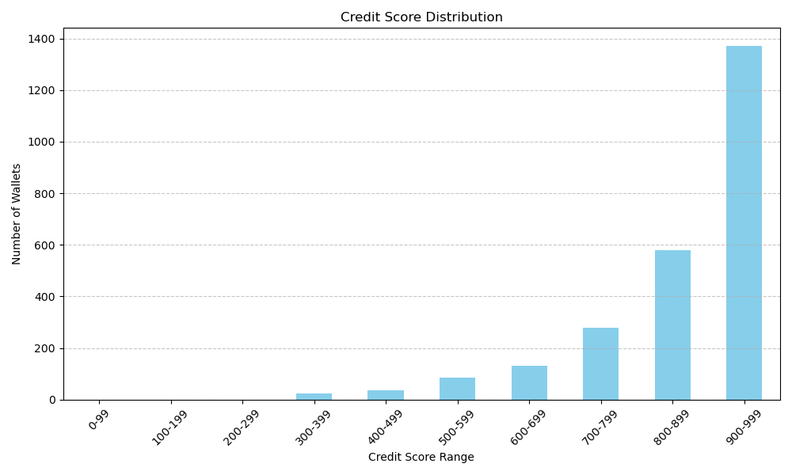

# Credit Score Analysis

This report provides insights derived from scoring wallet transactions using Isolation Forest. The scores were mapped to a 0–1000 scale for interpretability and analysis.

---

## 📌 Score Distribution

The score distribution of wallets is visualized below:

Grouped scores into buckets for better analysis:

| Score Range  | Wallet Count |
|--------------|--------------|
| 0–100        |  0 wallets   |
| 100–200      |  0 wallets   |
| 200–300      |  0 wallets   |
| 300–400      |  24 wallets   |
| 400–500      |  37 wallets   |
| 500–600      |  86 wallets   |
| 600–700      |  132 wallets   |
| 700–800      |  279 wallets   |
| 800–900      |  580 wallets   |
| 900–1000     |  1372 wallets   |

## Observations

### Wallets in the Lower Range
- Exhibit **highly irregular behavior**.
- Frequently interact with a **very small or very large number** of addresses.
- Show **high variance in transaction amounts**, possibly indicating spam or malicious activity.
- These wallets could be **fraudulent, bots**, or involved in **suspicious transfers**.

### Wallets in the Middle Range
- Exhibit **average or acceptable behavior**.
- Transaction frequencies and values fall within expected norms.
- Likely represent **regular users** with no alarming behavior.

### Wallets in the Higher Range
- Demonstrate **consistent and stable behavior**.
- Balanced transaction volume and value.
- Interact with a **diverse and consistent set of counterparties**.
- These wallets may belong to **trusted users or institutional accounts**.

## Conclusions

The anomaly-based wallet scoring model provides an effective unsupervised mechanism to flag unusual behavior in blockchain transactions.
By focusing on transaction patterns and statistical outliers, this approach helps identify potential fraud, bot activity, and trusted users — offering a strong foundation for fraud detection, credit scoring, and risk assessment in decentralized financial systems.

